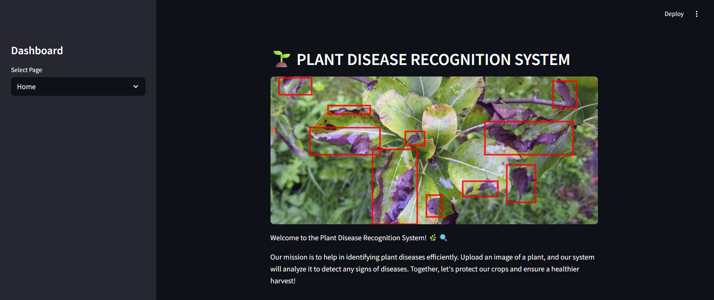
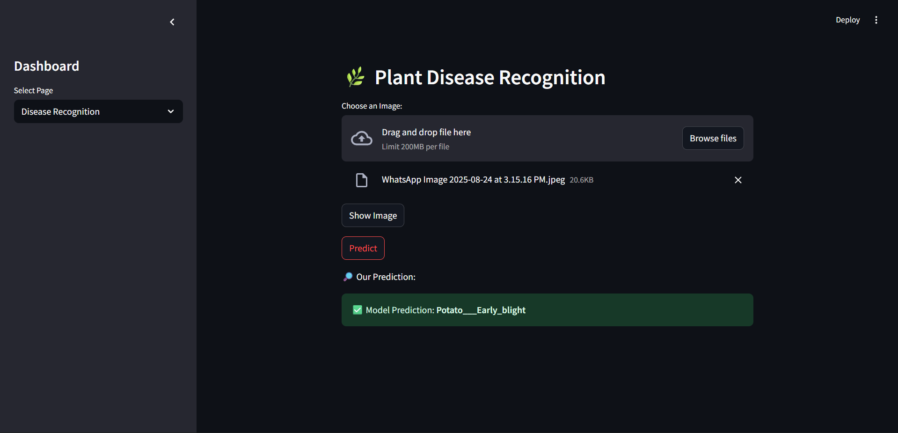

# 🌱 Plant Disease Detection System  

## 📌 Overview  
The **Plant Disease Detection System** is a deep learning–based project that identifies plant diseases from leaf images.  
It helps farmers and researchers detect crop diseases at an early stage, preventing crop loss and improving agricultural productivity.  

## ⚡ Features  
- Detects multiple plant diseases using **CNN / Deep Learning models**  
- Easy-to-use **web application** (Streamlit/Flask)  
- Real-time prediction on uploaded leaf images  
- Visualization of training accuracy & loss  
- Customizable to different datasets  

## 🗂 Dataset  
- Public dataset used: [New Plant Diseases Dataset](https://www.kaggle.com/datasets/vipoooool/new-plant-diseases-dataset)  
- Contains **healthy & diseased leaf images** across multiple crops.  
- Images are preprocessed (resized, augmented) before training.  


## 🤖 Model Training  
- Preprocessing: Resizing (128×128), Normalization, Augmentation  
- Architecture: **CNN (Convolutional Neural Network)**  
- Optimizer: Adam  
- Loss Function: Categorical CrossEntropy  
- Metrics: Accuracy, Precision, Recall  

Example Training Code:  
```python
model.fit(
    train_generator,
    validation_data=val_generator,
    epochs=50,
    steps_per_epoch=len(train_generator),
    validation_steps=len(val_generator)
)
```

## 📊 Results  
- Training Accuracy: ~96%  
- Validation Accuracy: ~96%  
- Supports **real-time prediction** in web app  

*(You can update with your actual results & graphs here)*  

## 🔮 Future Scope  
- Extend support for more plant species  
- Deploy on **mobile app (Android/iOS)**  
- Integration with **IoT devices & drones** for real-time monitoring  
- Cloud deployment (AWS/GCP/Heroku)  

## 📸 Screenshots  

### 🏠 Home Page  
  

### 🌿 Prediction Result  
  
  
